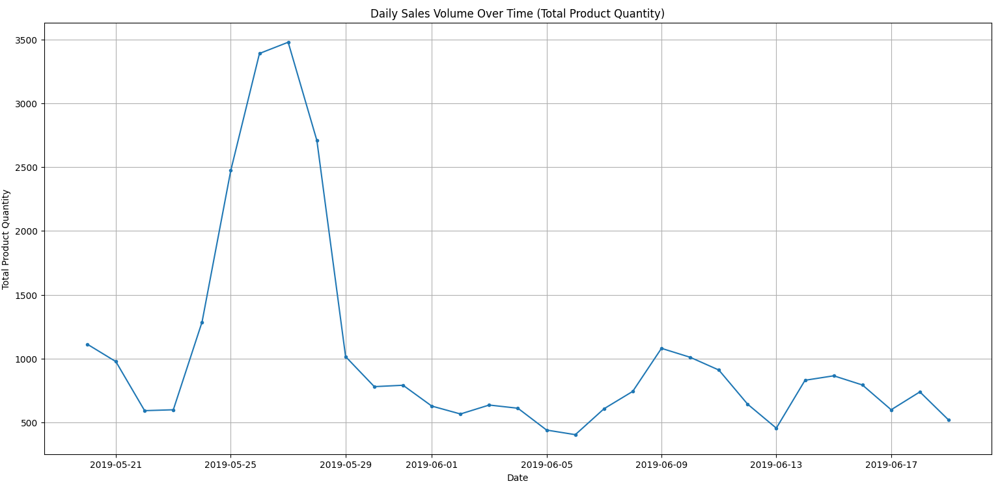
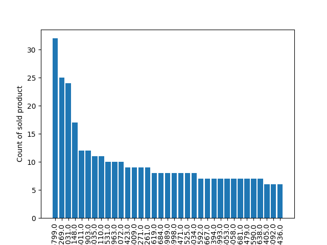

# 🛒 E-commerce Sales Data Analysis Report

This project aims to analyze customer (`customer_details.csv`) and basket (`basket_details.csv`) data from an e-commerce company to identify sales trends, product performance, and potential business strategies.

The analysis was performed using the `main.py` script with Python, Pandas, and Matplotlib libraries.

## 📊 Datasets Used

The project utilizes two main CSV files:

* **`customer_details.csv`**: Contains demographic information such as customer ID, sex, age, and tenure.
* **`basket_details.csv`**: Contains transactional data such as customer ID, product ID, basket date, and basket count (quantity).

These two datasets were merged on `customer_id` to create an enriched main DataFrame for analysis.

## ⚙️ Analysis Process

The analysis script (`main.py`) follows these core steps:

1.  Imports necessary libraries (Pandas, Numpy, Matplotlib).
2.  Reads `customer_details.csv` and `basket_details.csv` files.
3.  Merges the two DataFrames on `customer_id` using an `outer` merge.
4.  Fills missing (NaN) values with "Unknown" to prevent errors during analysis.
5.  Calculates the total sales (transaction) count for each product (`value_counts()`) to measure performance.
6.  Resamples the data by date (`resample('D')`) to analyze sales volume over time.
7.  Generates and saves the two primary visualizations (`volume.png` and `productsold.png`).

## 📈 Analysis and Visualizations

Two key outputs were generated from the analysis:

### 1. Daily Sales Volume Over Time (Total Product Quantity)

This line chart displays the total number of products sold daily over the observed period. It allows us to see instantaneous changes, peaks, and troughs in the company's overall sales volume.

**Inference:**
The chart reveals that sales volume exhibits significant daily fluctuations. On certain dates, there are sudden and sharp peaks in sales. This could be the result of special campaigns, email marketing activities, or bulk purchases on those specific days.

---

### 2. Top Selling Products (By Transaction Count)

This bar chart ranks the top-selling products based on the number of transactions. It clearly shows which products are the most popular among the customer base.

**Inference:**
The graph shows a typical **"long-tail" distribution** in product popularity.
* **Leading Products:** A significant portion of sales is dominated by the first few products on the chart. These can be considered the company's "star products."
* **Other Products:** The sales figures for the remaining products decrease rapidly, but they still constitute a significant volume in total.

## 🎯 Report and Strategic Recommendations: Which Products to Focus On?

Based on this analysis, the following strategic steps are recommended to improve sales performance:

### 1. Focus Point: "Star Products"

The **top-ranking products** (e.g., the top 5-10) in the "Top Selling Products" chart are the company's main source of revenue and traffic.

* **Stock Management:** These products should **never be out-of-stock**. The supply chain must be optimized to guarantee an uninterrupted flow for these items.
* **Marketing and Visibility:** These products should be continuously featured on the homepage, in the "Best Sellers" category, and in email newsletters.
* **Customer Feedback:** An analysis should be conducted to understand *why* these products are so popular. Customer reviews (if available) should be examined to identify the product's strengths and use these features in marketing language.

### 2. Cross-Selling Opportunities

Star products can be used as a locomotive to drive sales of other products.

* **Market Basket Analysis:** A deeper analysis should be performed to see **which other products customers are buying in the same basket** as the star products.
* **Bundle Offers:** By identifying complementary products frequently bought with star items ("Customers who bought this, also bought..."), bundle offers or "Frequently Bought Together" recommendation engines can be created. This will directly increase the Average Order Value (AOV).

### 3. Evaluation of Sales Volume Peaks

The sudden spikes in the "Daily Sales Volume" chart are not coincidental.

* It should be investigated which marketing activity (e.g., "One-Day-Only Sale," "New Product Launch," "Influencer Collaboration," etc.) corresponds to these peaks.
* These successful campaigns should be identified and replicated at different times of the year to boost low-volume days.

### 4. "Long-Tail" Management

The "niche" products that come after the top 10 but still have regular sales should not be ignored.

* These products are often found by customers searching for a specific need. Therefore, the **SEO (Search Engine Optimization)** titles and descriptions for these products should be strengthened.
* Instead of high-budget ads, low-cost marketing automation (e.g., "Customers who viewed this item, also viewed...") can be used for these products.

## 🛠️ Technologies Used

* **Python 3.x**
* **Pandas:** For data reading, cleaning, merging, and manipulation.
* **Numpy:** For numerical computations.
* **Matplotlib:** For data visualization and plot generation.